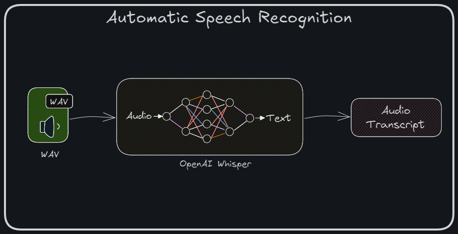

# Speech-Recog Microservice  
**Part of the Video Search Engine Project**  

The **Speech-Recog Service** is a Flask-based microservice designed to process video files and extract audio transcripts using an Automatic Speech Recognition (ASR) model. The service integrates seamlessly with Elasticsearch for indexing transcripts, enabling advanced search functionalities.



## Functionality
- The service accepts a video file via POST and saves it in the uploads directory.
- The audio track is extracted from the video for transcription and stored in the audios directory.
- It checks if the video has already been indexed in the database to prevent duplicates.
- The audio is transcribed into text using the ASR model.
- In standalone mode, it returns the transcript directly.
- In database mode, the transcript is stored in Elasticsearch, and the index state is updated in MySQL.
- A response is returned with the operation's success details based on the selected mode.

## Key Features  

- **Audio Extraction**: Extracts audio from uploaded video files.  
- **Speech Recognition**: Converts extracted audio into text using the ASR model.  
- **Elastic Indexing**: Stores transcripts in Elasticsearch for search and retrieval.  
- **Chained or Standalone Mode**:  
  - **Db Mode**: Works as part of the Video Search Engine pipeline.  
  - **Standalone Mode**: Operates independently, returning the transcript directly as API response.  


## Installation  

### Prerequisites  
- **Python**: Version `3.12`  
- **Elasticsearch**: Running instance for indexing transcripts. 
- **MySQL server:** With predefined table structure (`MYSQL_DUMP.sql`) loaded (only for db mode)
- The service runs on port `5005`, ensure no other services are using this port before running the application. 

### Steps  

1. **Clone the repository**:  
    ```bash  
    git clone https://github.com/iam-VK/speech-recog.git
    cd speech-recog  
    ```  

2. **Install dependencies**:  
    ```bash  
    ./setup.sh  
    ```  

3. **Download and setup ASR model**:  
    ```bash  
    ./setup_model.sh 
    ```  

4. **Run the service**:  
    ```bash  
    ./run.sh
    ```  

5. **Access the service**:  
    The service runs at `http://localhost:5005`


## API Endpoints  

### **1. Service Status**  
- **Endpoint**: `/`  
- **Method**: `GET` or `POST` 
- **Description**: Provides the status of the service and its available endpoints.  

**Response:** 
```json  
{
    "/speech-index": {
        "method": "POST",
        "parameters": {
            "file_upload": "<video file>",
            "mode":"optional parameter, can be 'standalone' or 'db' (default: 'db')"
        }
    }
}
```  

### **2. Speech Index**  
- **Endpoint**: `/speech-index`  
- **Method**: `POST`  
- **Parameters**:  
  - `file_upload`: Video file to be processed.  
  - `mode`: `"standalone"` or `"db"` (default).  

- **Description**:  
  - Extracts audio from video file and generates a transcript.  
  - In **standalone mode**, returns the transcript directly.  
  - In **chained (db) mode**, indexes the transcript into Elasticsearch.  

## Modes  

1. **Standalone Mode**:  
   - Extracts and returns the transcript directly.  
   - Suitable for isolated operations or testing.  

2. **Db Mode**:  
   - Integrates with Elasticsearch to index transcripts for later search and retrieval (Part of the Video Search Engine Project workflow).  

## Benefits  

- **End-to-End Integration**: Seamlessly processes video files and indexes transcripts for search.  
- **Flexible Modes**: Adapts to different workflows as a standalone or integrated service.  
- **Scalable Design**: Built to handle high-throughput indexing operations.  


This service plays a crucial role in the **Video Search Engine Project**, enabling efficient speech-to-text processing and transcript-based search capabilities.  
